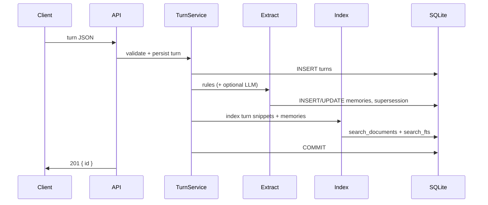

# Memory Service

A Dockerized memory service for AI agents. It ingests completed conversation turns, extracts **structured memories**, indexes them for **hybrid retrieval**, and returns formatted recall context for the next agent turn.

This is a single-service monolith optimized for a 48-hour engineering challenge: correct HTTP contract, durable persistence, synchronous consistency, and demonstrable fact evolution—not a production-scale vector database.

---

## Quick start

```bash
docker compose up --build
```

Service: `http://localhost:8000`

Optional: copy `.env.example` → `.env` and set `OPENAI_API_KEY` for LLM-assisted extraction. Without it, the service runs fully on deterministic rules.

### Smoke test

**Linux / macOS / Git Bash**

```bash
curl http://localhost:8000/health

curl -X POST http://localhost:8000/turns -H "Content-Type: application/json" -d '{
  "session_id": "demo",
  "user_id": "alice",
  "messages": [
    {"role": "user", "content": "I just moved from NYC to Berlin."},
    {"role": "assistant", "content": "Welcome to Berlin!"}
  ],
  "timestamp": "2025-06-01T12:00:00Z"
}'

curl -X POST http://localhost:8000/recall -H "Content-Type: application/json" -d '{
  "query": "Where does this user live?",
  "session_id": "demo",
  "user_id": "alice",
  "max_tokens": 1024
}'

curl http://localhost:8000/users/alice/memories
```

**Windows PowerShell:** use `curl.exe` (native `curl` is aliased to `Invoke-WebRequest`). See [MANUAL_TESTING.md](MANUAL_TESTING.md) for copy-paste commands.

Data survives `docker compose down && docker compose up` via the named volume `memory_data` mounted at `/data`.

---

## Architecture

### Design goals

| Goal | How we meet it |
|------|----------------|
| Not a message log | `memories` table with typed, keyed facts + supersession |
| Immediate consistency | Extraction and indexing run synchronously inside `POST /turns` before `201` |
| Hybrid recall | FTS5 lexical + TF-IDF semantic + rank fusion—not vector top-k only |
| Shippable in 48h | SQLite, no external DB, optional LLM |
| Container persistence | WAL SQLite on a Docker named volume |

### Layered monolith

```
┌─────────────────────────────────────────────────────────────┐
│  API (FastAPI)          routes.py, schemas.py               │
├─────────────────────────────────────────────────────────────┤
│  Orchestration          turn_service, recall_service        │
├──────────────┬──────────────────────┬─────────────────────┤
│  Extraction  │  Indexing            │  Retrieval          │
│  rules + LLM │  search_documents    │  lexical + semantic │
│  pipeline    │  + FTS5              │  + fusion + scope   │
├──────────────┴──────────────────────┴─────────────────────┤
│  Formatting             context.py (token-budget packing)   │
├─────────────────────────────────────────────────────────────┤
│  Persistence            SQLAlchemy → SQLite (/data)         │
└─────────────────────────────────────────────────────────────┘
```

```
src/
  api/                 HTTP contract, validation, payload limits
  core/                config, logging, errors
  db/                  ORM models, session, FTS init, uniqueness index
  services/
    extraction/        RuleExtractor, optional LLMExtractor, pipeline
    retrieval/         lexical (FTS5), semantic (TF-IDF), fusion, scope
    formatting/        recall context assembly
    indexing.py        dual-write to search_documents + search_fts
    turn_service.py    ingest orchestration
    recall_service.py  recall + search orchestration
    memory_service.py  user memory listing, session/user deletion
```

### Request flows

**Ingest (`POST /turns`)**



**Recall (`POST /recall`)**

```mermaid
flowchart TD
    A[Recall request] --> B[Load active user memories]
    A --> C[Hybrid search session + user scope]
    B --> D[Merge + filter stale conversation text]
    C --> D
    D --> E[ContextFormatter: facts → prefs → events → chat]
    E --> F[Pack under max_tokens]
    F --> G[{ context, citations }]
```

### Why a monolith?

- **Single transaction boundary** — turn, memories, and index update commit together; recall is consistent immediately after `201`.
- **No network hop** between extraction and indexing during ingest.
- **Reviewer clarity** — one Dockerfile, one compose service, one database file.

A split design (separate extractor worker, vector DB, queue) would be more scalable but harder to ship and test within the challenge window.

---

## Persistence

### Backing store: SQLite + WAL

| Component | Location | Role |
|-----------|----------|------|
| Database file | `/data/memory.db` (Docker volume `memory_data`) | Turns, memories, search index |
| WAL mode | `PRAGMA journal_mode=WAL` | Safer concurrent reads during writes |
| FTS5 virtual table | `search_fts` | Lexical retrieval (Porter stemmer) |

**Tables**

| Table | Purpose |
|-------|---------|
| `turns` | Raw conversation turns (`messages` JSON, metadata, timestamp) |
| `memories` | Structured extracted memories with `active`, `supersedes`, provenance |
| `search_documents` | Unified retrieval corpus (memory lines + turn snippets) |
| `search_fts` | FTS5 index keyed by `doc_id` → `search_documents.id` |

**Schema enforcement**

- Partial unique index: one **active** memory per `(user_id, key)` — prevents duplicate active facts under concurrency.
- `create_all` on startup (no migration framework)—acceptable for challenge scope; production would use Alembic.

**What persists across restart**

```bash
docker compose down      # volume retained
docker compose up -d     # same /data/memory.db
```

Use `docker compose down -v` only when you intentionally wipe data.

---

## Extraction pipeline

Extraction turns user utterances into structured `Memory` rows. It is **not** storing the full chat as the only artifact.

### When extraction runs

- Runs **synchronously** on every `POST /turns` inside the same DB transaction.
- **Skipped** when `user_id` is `null` (anonymous turns are stored but not extracted).

### Pipeline steps

1. **Rule extraction** (`RuleExtractor`) — default, no API key required.
   - Parses **user** messages only (assistant/tool text is not extracted).
   - Regex patterns for: employment, location, moves, family, pets, preferences, opinions.
   - Correction prefixes: `actually`, `I meant`, `no wait`, etc.
   - Special handlers: `moved from X to Y`, employment change across clauses.
2. **Optional LLM extraction** (`LLMExtractor`) — if `OPENAI_API_KEY` is set.
   - Merged with rules by normalized `key`; higher confidence wins.
   - On any failure, falls back to rules-only (logged, non-fatal).
3. **Candidate merge** — one candidate per `key` per turn batch.
4. **Supersession persist** — see [Fact evolution](#fact-evolution-supersession).
5. **Index** — each affected memory + turn snippets written to search layer.

### Memory shape

| Field | Example | Notes |
|-------|---------|-------|
| `type` | `fact`, `preference`, `opinion`, `event` | Enum |
| `key` | `employment.company`, `location.residence` | Normalized dotted key |
| `value` | `Notion` | Short string |
| `confidence` | `0.92` | Rule-assigned or LLM |
| `source_session`, `source_turn` | provenance | Audit trail |
| `active` | `true` / `false` | Only one active per key per user |
| `supersedes` | UUID or `null` | New row points to replaced row |

### Extraction limits (honest)

- Regex misses implicit facts (“we relocated last spring”), multi-clause preferences, and assistant-confirmed facts.
- Opinions share `opinion.general` — evolution is supersession, not gradual versioning.
- LLM path is optional and not covered by CI; prompt/schema should be hardened for production.

---

## Retrieval pipeline

Retrieval is **hybrid by design**. Exact-token queries (company names, cities) must not rely on embeddings alone.

### Two entry points

| Endpoint | Output | Use case |
|----------|--------|----------|
| `POST /recall` | Formatted `context` + `citations` | Inject into next agent prompt |
| `POST /search` | Structured `results[]` | Debugging, tooling, explicit lookup |

Both use `HybridRetriever`; recall adds active-memory injection and context formatting.

### Scoping

When **both** `session_id` and `user_id` are provided, documents match:

```text
session_id = <session>  OR  user_id = <user>
```

This allows **cross-session recall**: facts learned in session A are visible in session B for the same user. Lexical (FTS) and semantic (TF-IDF) channels share the same scope via `services/retrieval/scope.py`.

`POST /search` requires at least one of `session_id` or `user_id` to prevent unscoped cross-tenant queries. The challenge OpenAPI allows both IDs to be null; we intentionally deviate for **security** (see [Search scope deviation](#search-scope-deviation) below).

### Channel 1: Lexical (FTS5)

- Query tokenized → OR-joined FTS `MATCH` (reserved FTS tokens `AND`/`OR`/`NOT`/`NEAR` stripped).
- Ranked by SQLite `bm25(search_fts)`.
- Strong for exact names: `Berlin`, `Notion`, `Stripe`.
- Malformed FTS syntax returns **empty lexical hits** (logged); search/recall never crash with `500`.
- Queries with no alphanumeric tokens are rejected with `422`.

### Channel 2: Semantic (TF-IDF)

- Per-request `TfidfVectorizer` (unigrams + bigrams) over scoped documents.
- Cosine similarity vs query, scores normalized 0–1.
- **Not** a frozen embedding model—lightweight and offline, weaker on paraphrase than `text-embedding-3-small` etc.
- `embedding` JSON on `search_documents` is stored but **not** used at query time today.

### Fusion and boosts

1. **Reciprocal Rank Fusion (RRF)** merges lexical and semantic ranked lists.
2. **Post-fusion boosts**: memory type, `active=true`, fact type, recency decay, query-token overlap.
3. Inactive memory **documents** are excluded from search corpus; turn snippets may still mention superseded values.

### Recall-specific logic

`recall_candidates` does more than `search`:

1. **Inject all active memories** for the user (boosted higher when query intent matches key/domain).
2. **Merge** with hybrid search hits from session + user scope.
3. **Filter** turn snippets that contain inactive (superseded) memory values.
4. **`ContextFormatter`** orders: facts → preferences/opinions → events → conversation; packs under `max_tokens` using `len/4` heuristic.

**Priority intent**

1. Stable active facts (structured memories)
2. Query-relevant memories (intent heuristics on keys)
3. Recent conversation snippets (if budget remains)

Context is assembled only from indexed content—**never hallucinated**.

### Known retrieval gaps

- No query rewriting or reranker model.
- `SEMANTIC_WEIGHT` / `LEXICAL_WEIGHT` in `.env.example` are **reserved but not wired** into fusion yet; only `RECENCY_WEIGHT` affects post-fusion boosts.
- `/search` may still return old turn text; `/recall` filters stale factual snippets.

---

## Fact evolution (supersession)

Facts change over time. The service keeps **history** and serves **current truth**.

### Rules

| Event | Behavior |
|-------|----------|
| New value, same `(user_id, key)` | Old row: `active=false`. New row: `active=true`, `supersedes=<old_id>`. |
| Same value repeated | Update confidence/timestamp/provenance; no new row. |
| Different keys | Coexist (e.g. `location.residence` + `location.previous`). |

### Example: employment change

```text
Turn 1: "I work at Stripe."     → active employment.company = Stripe
Turn 2: "I just joined Notion." → active employment.company = Notion
                                  Stripe row active=false, supersedes link set
```

`GET /users/{id}/memories` returns **both** rows. `POST /recall` prefers Notion and suppresses Stripe in context.

### Concurrency

1. Deactivate old row **before** inserting new active row (avoids unique-index violation).
2. Partial unique index: `CREATE UNIQUE INDEX ... ON memories(user_id, key) WHERE active = 1`.
3. `IntegrityError` → one retry on concurrent writes to the same key.

### What we do not do yet

- Cross-key deduplication (`NYC` vs `New York City`).
- Gradual opinion evolution (all opinions share `opinion.general`).
- Explicit contradiction objects—only key-level supersession.

---

## Tradeoffs

| Decision | Why | Cost |
|----------|-----|------|
| **SQLite monolith** | Zero deps, FTS5 built-in, volume persistence | Write throughput, no horizontal scale |
| **Sync extract + index** | Immediate recall after `201` | Turn latency bound to extraction |
| **Regex-first extraction** | Deterministic, testable, no API key | Low recall on implicit/nuanced facts |
| **TF-IDF “semantic”** | Offline, fast, no model download | Weak paraphrase; not true embeddings |
| **RRF fusion** | Simple, robust when one channel is empty | Not learned; weights not tuned |
| **Turn snippet indexing** | Recall works before extraction patterns match | Search noise; stale text until filtered in recall |
| **Search scope required** | Prevents cross-user leakage | Stricter than minimal OpenAPI (both IDs nullable) |
| **No auth** | Challenge scope | Production needs API keys / tenancy |

### Search scope deviation

The published contract allows `POST /search` with both `session_id` and `user_id` null (global search). This implementation **requires at least one scope ID**.

| Rationale | Detail |
|-----------|--------|
| Security | Unscoped search would return documents across all users/sessions in the shared SQLite corpus—a data-leak risk in multi-tenant demos. |
| Reviewer impact | Slightly stricter than spec; behavior is documented and tested (`test_search_requires_scope`). |
| Alternative rejected | Allowing global search would need explicit `admin` flag or auth—not in challenge scope. |

Recall already requires meaningful scope in practice (user memories need `user_id`). Search alignment keeps the retrieval surface consistent.

---

## Failure modes

| Condition | Response | Notes |
|-----------|----------|-------|
| Missing `user_id` on turn | `201`; no memories | Turn still searchable by session |
| Invalid JSON / validation | `422` | Service stays up |
| Oversized turn body | `413` | `MAX_TURN_PAYLOAD_BYTES` (default 1 MiB) |
| LLM failure | Rules-only | Logged |
| Nothing relevant | `recall: { "context": "", "citations": [] }` | |
| Health check | `200` when DB + FTS ready; `503` if degraded | Probes `SELECT 1` and `search_fts` |

---

## Future improvements

Ordered by impact for a production v2:

1. **Filter superseded text in `/search`** — align with recall stale-value filtering.
2. **Query-aware memory injection** — inject only query-relevant active facts, not all user memories.
3. **True embeddings** — `fastembed` or API embeddings; use stored vectors at query time.
4. **Wire fusion weights** — honor `SEMANTIC_WEIGHT` / `LEXICAL_WEIGHT` from config.
5. **Fix LLM extractor** — JSON schema, tests with mocked OpenAI.
6. **Opinion evolution** — append-only opinion history or topic-scoped keys.
7. **Alembic migrations** — safe schema changes on live volumes.
8. **Docker CI test** — automated `compose down && up` persistence job.

See also [COMPLIANCE_AUDIT.md](COMPLIANCE_AUDIT.md) and [MANUAL_TESTING.md](MANUAL_TESTING.md).

---

## API summary

| Method | Path | Description |
|--------|------|-------------|
| GET | `/health` | Readiness (DB + FTS) |
| POST | `/turns` | Ingest turn + extract + index |
| POST | `/recall` | Formatted context for next turn |
| POST | `/search` | Structured search results (scoped) |
| GET | `/users/{user_id}/memories` | All structured memories (active + inactive) |
| DELETE | `/sessions/{session_id}` | Delete session data |
| DELETE | `/users/{user_id}` | Delete all user data |

---

## Running tests

```bash
python -m venv .venv
source .venv/bin/activate          # Windows: .venv\Scripts\activate
pip install -r requirements.txt
pytest -v
```

| Suite | File | What it proves |
|-------|------|----------------|
| Contract roundtrip | `tests/test_contract.py` | Ingest → recall → memories shape |
| Persistence | `tests/test_persistence.py` | SQLite file survives engine restart |
| Isolation | `tests/test_isolation.py` | Users do not bleed |
| Malformed input | `tests/test_malformed.py` | 4xx on bad input, FTS poison queries, scoped search |
| Health readiness | `tests/test_health.py` | DB + FTS probes on `/health` |
| Supersession | `tests/test_supersession.py` | Stripe → Notion evolution |
| Recall quality | `tests/test_recall_quality.py` | Fixture conversations ≥75% fact hit rate |
| DELETE | `tests/test_delete.py` | Session/user deletion |
| Cross-session | `tests/test_cross_session_recall.py` | User facts visible across sessions |

Manual QA: [MANUAL_TESTING.md](MANUAL_TESTING.md)

---

## Related docs

- [CHANGELOG.md](CHANGELOG.md) — iteration history
- [COMPLIANCE_AUDIT.md](COMPLIANCE_AUDIT.md) — requirement-by-requirement audit
- [MANUAL_TESTING.md](MANUAL_TESTING.md) — full manual QA checklist
- [.env.example](.env.example) — configuration reference
